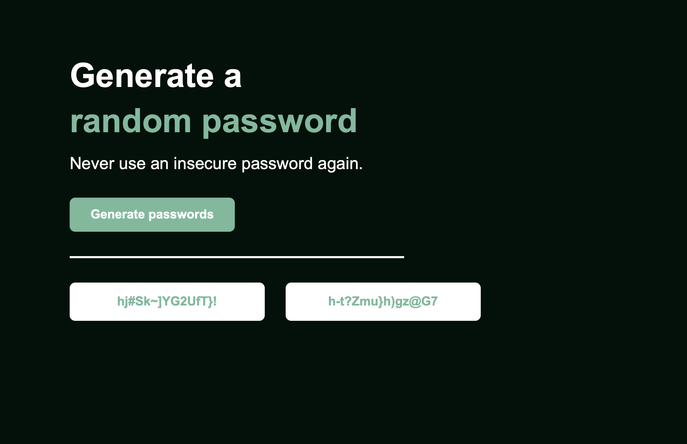

# 🔐 Random Password Generator

A simple random password generator built with HTML, CSS, and JavaScript. It generates two random passwords to help users create stronger and more secure passwords.

## Preview



## Features

- Generate two random passwords
- Random combination of letters, numbers, and symbols
- Simple and clean user interface
- Generate new passwords with one click

## Built With

- HTML
- CSS
- JavaScript

## How to Use

1. Open the website.
2. Click **Generate passwords**.
3. Two randomly generated passwords will appear.
4. Click the button again to generate new passwords.

## Project Structure

```text
password-generator/
├── index.html
├── style.css
├── script.js
├── main-page.png
├── password-generated-page.png
└── README.md
```

## What I Learned

Through this project, I practiced:

- JavaScript functions
- Arrays
- Random number generation with `Math.random()`
- DOM manipulation
- Handling button click events
- Connecting JavaScript with HTML and CSS

## Author

**Sopanha Neth**